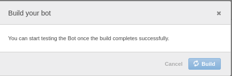

# Chat-bot development using Amazon Lex

Lex is an easy to use service that makes the task of chat-bot building **very fast** and hassle free. In a matter of minutes, a fully functional bot can be developed from the scratch. This only leaves a developer with the task of integration, where bot interface is integrated with application specific back-end or some messaging platform.


In this article, we'll go through the entire process from building a Lex bot, to a Ruby based web API developement, for wide range of application support. Let's build a pizza ordering bot!

## Bot development

Since, the bot is an AWS service, certainly we are going to need an AWS account. Once we have that, the route is simple.

First, go to the AWS console, and from the "Services", select "Amazon Lex" in "Machine Learning" section. Now, choose to create a Lex bot. You will be offered with several options, including some sample. But, we are going to build a bot from the scratch, so we shall choose "Custom bot".

Now, give the bot a name (for our case, it is "PizzaBot"). We are building a text based chat bot, so we are going to set the "Output voice" option to "None". Note that, we are developing a text-only bot. Session timeout decides, for how long the bot should remember a conversation. If you leave an in-progress conversation, and come back within the specified timeout, you will be able to continue from where you left off. Otherwise, a new conversation will start. The last option we need to set in this phase is "COPPA", which should be marked as "No", unless you are developing a bot that contains materal inappropriate for underaged. Now click "Create" to proceed.


Now that we created an identifiable bot, our next step will be to setup the nuts and bolts, to familiarize the bot with our application specific flow. An **intent** is an action that the user is opted to perform. A bot may have many different intents. For us, to keep the thing simple, let's create a single intent that helps the user to order a pizza. From "Create intent" click "Create new intent" and name it "OrderPizza".

Once we created our intent, we need to provide a sample user response that will trigger the intent. It is called **utterance** in Lex. Let's add a sample utterance "I would like to order a pizza". ML model in Lex will automatically infer any utterace that goes closely in sync with the sample utterance.

When an utterance is successfully triggered, Lex will look in it's database for any available slot to fill. A **slot** is a conversational step, where the application prompts the user for a parameter. Every slot has a "slot value". A slot type can be chosen from the available built-in types or a new type can be defined. A slot is passed only if a slot value compatible with the corresponding **slot type** is provided by the user.

For our "OrderPizza" intent, we have three questions to ask our user. Our application needs to know the pizza type, pizza size and user's address. Since, a slot resembles a question answer cycle, we need three slot types. Click on the "+" sign next to "Slot types" on the left panel. In the slot type creation form, Let's give it a name "PizzaTypes", description "Available pizza types" and slot resolution "Restrict to Slot values and Synonyms". If we choose "Expand Values", Lex will use ML to determine and validate a slot value. Since, we have chosen "Restrict to Slot values and Synonyms", we are restricting user's preference to a predefined enumeration (Of course, if a pizza shop offers only Margarita, we would not like our user to choose "Mexican", right? **:)** ). Let's add several values "Margarita", "Mexican Pizza", "Veggie Lover", "Hawaiian", "Spicy Chicken lovers" and "Mushroom Lover". **:)**


Similarly, let's add another slot for the pizza size.

- *PizzaSizes:*
  - *Description:* Available pizza sizes
  - *Slot Resolution:* Restrict to Slot values and Synonyms
  - *Value:*
    - Medium
    - Large

We are ready to create the slots. Let's create three slots according to the following configuration:

- *Slot:* Type
  - *Required:* true
  - *Slot type:* PizzaType
  - *Prompt:* What type of pizza do you want to order?

- *Slot:* Size
  - *Required:* true
  - *Slot type:* PizzaSizes
  - *Prompt:* What size would you prefer? (e.g. Medium, Large)

- *Slot:* Location
  - *Required:* true
  - *Slot type:* AMAZON.PostalAddress
  - *Prompt:* Please enter delivery location


When user passes through all the slots, we want to get a confirmation (Otherwise, we might not get paid for the delivered pizza ;) ). Let's add a **confirmation prompt**. Expand the "Confirmation prompt" section below "Slots", and check it. Now, add a prompt message, "Are you sure you want to order a {Size} {Type}?", and a cancellation message, "Okay, I'll cancel your order.", which will be triggered if user provides a negative response.


We are almost done with setting up our bot, except, we are missing the **fallback** scenarios. We need to handle the situation when user doesn't provide the expected response. Select "Error Handling" from the left panel and add,

- *Clarification prompt:* Sorry, I didn't understand. I can help you to order a pizza!
- *Maximum number of retries:* 5
- *Hang-up phrase:* Sorry, I could not understand. Goodbye.

Whan an invalid response is received, clarification prompt is triggered. But, if invalid response is received for *n* (maximum number of retries) times, another consecutive invalid response will trigger the hang-up phrase. Now save, build and publish.



Once the bot is built and published, it can be tested. Click the "Test Chatbot" from the right panel. It's time to test the conversation flow.


Notice that, although our sample utterance was, "I would like to order a pizza", Lex accepted, "I want to order a pizza" as a trigger! This is handled by the ML model behind Lex.

Yey! we successfully built our first Lex bot.

## Back-end client development

Each AWS API access requires authorization for some certain kind of resource. To serve our purpose, we need to create an IAM user with programmatic access enabled. From AWS console, select "IAM", choose "Users" from the left panel, and add an user with "Programmatic access" checked for "Access type" and add "AmazonLexRunBotsOnly" permission. Take a note of the "Access Key ID" and "Secret Access Key".


The bot is now tested and ready for deployment. AWS offers us with a large number of SDK to choose from. For now, let's have a look at the Ruby SDK. In the next phase, we are going to build a simple web API for our Lex bot, so that we can integrate it with any web enabled application.

In order to deploy our bot, we need to provide the bot an alias. From "Settings" choose "Aliases" and create an alias named "TestBot". Now, "Publish", and now our bot is ready for any SDK integration!


### Bot API - Ruby

There are countless ways to integrate Lex with any application. One such way is integration through web API. Here's a very basic API implementation in Ruby.

```ruby
require "sinatra"
require "aws-sdk"
require "json"

Aws.config.update({
  credentials: Aws::Credentials.new(
    "ACCESS_KEY_ID",
    "SECRET_ACCESS_KEY"
  ),
  region: "us-east-1"
})

class LexClientService
  def initialize user_id, bot
    @bot = bot
    @client = Aws::Lex::Client.new
    @user_id = user_id
  end

  def response message
    @client.post_text({
      bot_name: @bot[:name],
      bot_alias: @bot[:alias],
      user_id: @user_id,
      input_text: message
    })
  end
end

post "/respond" do
  begin
    client = LexClientService.new "U01", name: "PizzaBot", alias: "TestBot"
    response = client.response JSON.parse(request.body.read)["message"]

    JSON.generate({message: response.message, state: response.dialog_state})
  rescue
    status 500
    body ""
  end
end
```

Let's go through the code for a bit. We are using Sinatra, because of it's rapid prototyping capability. We need "aws-sdk", cause the Lex bot runtime API is available through it.

In the first phase, we are configuring the AWS SDK by providing the IAM credential and bot availability zone.

We defined a `LexClientService`, that acts as a convenience wrapper. It aids in creating a bot instance and channeling message to and from a client session. Initialization requires `user_id` as the first parameter and a bot identifier hash (`{name: BotName, alias: BotAlias}`) as the second. `response` accepts a message and returns a response object from lex, which has the following format.

```ruby
{
  "dialogState": STATE,
  "intentName": INTENT_NAME,
  "message": MESSAGE,
  "messageFormat": FORMAT,
  "responseCard": RESPONSE_CARD,
  "sessionAttributes": SESSION,
  "slotToElicit": SLOT,
  "slots": SLOTS
}
```

The primary and only available end-point of our API is a `POST` request, at route `/respond`. It is solely a consumer of `LexClientService`. The API has following data format,

##### Request format

```ruby
{
  "message": MESSAGE_STRING
}
```

##### Response format

```ruby
{
  "message": MESSAGE_STRING,
  "state": DIALOG_STATE
}
```

A point to note about the response JSON structure is that, it is an stripped down version of the response from Lex. A more sophisticated implimentation will utilize more data-point available in `LexClientService#respond`.

Our API implementation is demonstration only. Certainly, a production level implementation will have more feature demand (e.g. session authentication). But, I am leaving the application specific tuning to you. **;)**

So far, we learnt about building a Lex bot from the scratch, configuring AWS for the bot and the API, and built a simplified Ruby web API implementation. Still, we are missing a lot. Lex can be integrated directly with messaging platforms like facebook messanger. The upcoming installment of this article will demonstrate messaging platform integration. Until then, happy coding! **:)**

## References
- https://docs.aws.amazon.com/lex/latest/dg/lex-dg.pdf
- https://docs.aws.amazon.com/sdk-for-ruby/v3/api/Aws/LexRuntimeService.html
- https://aws.amazon.com/sdk-for-ruby/
- https://aws.amazon.com/documentation/lex/
- https://docs.aws.amazon.com/sdk-for-ruby/v3/developer-guide/setup-config.html#aws-ruby-sdk-credentials-environment
- https://aws.amazon.com/lex/

