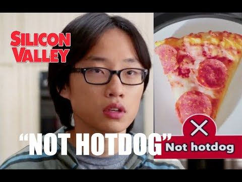

# Cloud API: Detect objects from any image



Remember the hot dog classifier of Jian-Yang from [Silicon Valley](https://www.imdb.com/title/tt2575988/)? I believe, many of the Silicon Valley watchers (including me :D ) wondered at least once about developing the hot dog classifier themselves. While googling, I found out that someone actually took the effort and time to build one! And, interesting thing is, [the project](https://github.com/kmather73/NotHotdog-Classifier) is quite popular! If you are one of those watchers, or maybe just thinking about a product that requires object recognition, you may not have to look too far, since there are several solutions now readily available, which may satisfy your needs out of the box. These cloud based solutions are being widely adopted for several reasons, but primarily to avoid,

- training a custom model from the scratch
- developing a service
- managing a service

In this article, we are going to have a look at object recognition and its applications, popular recognition services and their service offerings, and utilizing Google cloud vision API as a managed recognition service. Let's get started!

## Applications

Image recognition has a wide set of applications. Cloud APIs often focus on some specific use cases, including but not limited to,

- Image organization
- Image tagging
- OCR
- Product search (Google has a dedicated api specifically for this purpose)
- Face detection
- Augmented reality
- And, many more.

## Several Popular Services

Readily available object recognition solutions are often managed and are ready to be used, and also they often features the possibility for customization (flexible options, custom models etc.). All of these possibilities are often enough to motivate a team to utilize cloud service instead of developing one from the scratch. Let's have a look at some of the services and their service offerings.

### #1 [Google Cloud Vision API](https://cloud.google.com/vision/)

Google cloud vision API is a fully managed recognition service that has a rich feature set including,

- Possibility to utilize the predefined models
- Possibility to define custom models
- Label, face, logo, color detection
- OCR
- Localization
- Explicit and unsafe content detection
- Product detection
- Wide range of client API support (including, REST, Ruby, Python, C#, GO, Java, JS and PHP)

### #2 [Amazon Rekognition](https://aws.amazon.com/rekognition/)

Amazon Rekognition supports image and video analysis both. The builtin models can detect a wide range of objects. The feature set can be summarized as,

- Possibility to utilize the predefined models
- Possibility to define custom models (via [Amazon SageMaker](https://aws.amazon.com/sagemaker/))
- Label, face (including known face query), celebrity detection
- OCR
- Explicit and unsafe content detection
- Supports a number of client API (includes, REST, Ruby, Python, Java, JS, Swift, C# and PHP)

### #3 [Microsoft Azure Cognitive Services](https://azure.microsoft.com/en-us/services/cognitive-services/)

Cognitive services is an initiative from Microsoft aimed at developing API based cognitive services which includes vision API. The cognitive vision service includes the following features.

- Possibility to utilize the predefined models
- Possibility to define custom models (via [Custom Vision](https://azure.microsoft.com/en-us/services/cognitive-services/custom-vision-service/))
- Label, face, color detection
- OCR
- Localization
- Explicit and unsafe content detection
- Face recognition
- Caption detection
  - It's an interesting feature which generates caption based on the image content. (example: "a group of people on a city street at night")
- Supports a number of client API (includes, REST, Python, JS, C#, Java and Go)

### #4 [Watson Visual Recognition](https://www.ibm.com/watson/services/visual-recognition/)

Watson is another recognition service, from IBM. It has the following service offerings.

- Possibility to utilize the predefined models
- Possibility to define custom models
- Possibility to run detection against a specific model (both, custom and predefined ones)
- Label, face, color detection
- OCR (not released yet)
- Supports REST API

### #5 CloudSight.AI

An image detection service that runs on EC2 clusters. This service offers,

- Label detection
- Explicit content detection
- Supports REST API

### #6 Vize.AI

A detection service that relies on custom trained neural network. The workflow requires you to provide sample image set and train a neural network before it can be utilized. It features,

- Possibility to define custom models
- Label detection
- Supports REST API

## Recognizing Objects Using Cloud Vision

As briefed above, Cloud Vision API provides a rich feature set, wide range of API client availability and documentation. So, the API integration in application is convenient and time saving. In this section, we are going to go through some of the most commonly adopted recognition APIs. For sake of wide scale compatibility, we'll primarily investigate the REST API.

### Prerequisites

Cloud Vision API utilization requires some prior steps to be completed. These are the followings.

- **Step #1**: All the Google Cloud product requires a Google account. Additionally, Vision API requires billing account to be activated. This implies that, you need to to have a verified billing method (e.g. credit card) enabled.
- **Step #2**: Once both of the requirements above are satisfied, Cloud Vision [API need to be enabled](https://console.cloud.google.com/flows/enableapi?apiid=vision-json.googleapis.com).
- **Step #3**: To access API through client, we need to [generate service account key](https://console.cloud.google.com/apis/credentials/serviceaccountkey).
- **Step #4**: And, finally, we need to [generate an API key](https://cloud.google.com/vision/docs/auth) to access the Vision API from REST interface.

**NOTE**: Please note that the generated keys above are intended to be used for *server to server* communication. Never use this key on front-end applications, as this will compromise the service account.

For more details, please [check out the documentation](https://cloud.google.com/vision/docs/quickstart-client-libraries).

### Object Classification / Tagging

Object tagging or identifying the contents that an image is composed with, is the core feature that all the recognition service provides. Usually, most of the other service features are derivatives of this tagging process (e.g. localization). And, some more advanced services (e.g. OCR) often depends on the results of classification.

In order to extract all the available tags from an image, we make the following request.

**Request:**
```text
POST https://vision.googleapis.com/v1/images:annotate?key=<API_KEY>
```

**Body**
```json
{
  "requests": [
    {
      "image": {
        "source": {
          "imageUri": "https://example.com/dog.jpg"
        }

      },
      "features": [
        {
          "type": "LABEL_DETECTION"
        }
      ]
    }
  ]
}
```

**Example Response**
```json
{
    "responses": [
        {
            "labelAnnotations": [
                {
                    "mid": "/m/0bt9lr",
                    "description": "dog",
                    "score": 0.9690748,
                    "topicality": 0.9690748
                },
                {
                    "mid": "/m/0kpmf",
                    "description": "dog breed",
                    "score": 0.94261575,
                    "topicality": 0.94261575
                },
                {
                    "mid": "/m/01t032",
                    "description": "golden retriever",
                    "score": 0.9184127,
                    "topicality": 0.9184127
                },

                ...

            ]
        }
    ]
}
```

Let's investigate a bit. `API_KEY` is the key we retrieved in *prerequisites - step #4*. Request specifies the URL of an image for which we want to extract the labels. Additionally, we defined the type of feature we want to extract, which, in this case, is `LABEL_DETECTION`.

In the response section, we are primarily interested in *description* and *score*. Here,

- **description** is the tag/class name
- **score** is the confidence score, which ranges from `0` (no confidence) to `1` (very high confidence)
- **mid** is the unique tag identifier which become particularly helpful in scenarios like localization (cause, localization results are usually referenced against a specific *mid*).

The above request will retrieve all the matching tags, exhaustively. But, we could make a more fine grained request. :)

What if we want only the first ten tags (sorted by descending order of confidence level, by default)? To achieve this, we may manipulate the request as follows,

```json
{
  "requests": [
    {
      ...

      "features": [
        {
          "type": "LABEL_DETECTION",
          "maxResults": 10
        }
      ]

      ...
    }
  ]
}

```

Ruby syntax for an identical request will looks a follows (although, the following request does not enforce `maxResults` constraint).

```ruby
require 'google/cloud/vision'

project_id = <PROJECT_ID>
vision = Google::Cloud::Vision.new project: project_id
labels = vision.image(file_name).labels
p labels
```

**NOTE**: The Ruby snippet requires [google-cloud-vision](https://github.com/googleapis/google-cloud-ruby/tree/master/google-cloud-vision) gem to be installed. And, additionally, it expects that the shell environment contains `GOOGLE_CLOUD_KEYFILE` variable, which stores the path to the JSON key file extracted in *prerequisites - step #3*.

Additionally, we have the following options that we might get interested in, eventually.

### Object Localization

Object localization is probably the most demanding feature after recognition. Cause, many of the intermediate detection and recognition services (e.g. context specific OCR) and their accuracy, are directly dependent on proper localization of an object in the image.

In order to enable localization, we update the request body as follows.

**Request Body**
```json
{
  "requests": [
    {
      ...

      "features": [
        {
          "type": "LABEL_DETECTION",
          "maxResults": 10
        },
        {
          "type": "OBJECT_LOCALIZATION"
        }
      ]

      ...
    }
  ]
}

```

**Response**
```json
{
    "responses": [
        {
            "labelAnnotations": [
              ...
            ],
            "localizedObjectAnnotations": [
                {
                    "mid": "/m/0bt9lr",
                    "name": "Dog",
                    "score": 0.98185194,
                    "boundingPoly": {
                        "normalizedVertices": [
                            {
                                "x": 0.35950947,
                                "y": 0.0031823122
                            },
                            {
                                "x": 0.6809611,
                                "y": 0.0031823122
                            },
                            {
                                "x": 0.6809611,
                                "y": 0.9982294
                            },
                            {
                                "x": 0.35950947,
                                "y": 0.9982294
                            }
                        ]
                    }
                }
            ]
        }
    ]
}
```

The above response returns the coordinate for bounding box, as expected. Now, we can use it for further processing. Yey!

### Hot dog / not hot dog


I just can't forget about that *hot dog / not hot dog classifier* :D . Let's get it over with. Considering the fact that we already have a very good hot dog classifier already available from Google ;) , we can update our Ruby snippet above to mimic the result of "Jian-Yang"'s hot dog classifier. Have fun!

```ruby
require 'google/cloud/vision'

project_id = <PROJECT_ID>
vision = Google::Cloud::Vision.new project: project_id
labels = vision.image(file_name).labels
isHotdog = labels.map{|label| label.description}.include? "hot dog"

puts isHotdog ? "Hot dog!" : "Not Hot dog"
```

## Conclusion

Image tagging has a lots of applications, some of which we have already seen. It can be really an interesting topic to work with, from a developers perspective. In this article, we used the basics of object detection using predefined models from Cloud Vision. While this can serve many application needs, some application specific needs may arise at some point, that can not be satisfied only using the predefined models. And, this is where [Cloud AutoML](https://cloud.google.com/automl/) comes to play, which aids in developing custom models. But, let's leave it for another article! ;) Happy detecting!

## References

- https://cloud.google.com/vision/docs/labels
- https://docs.aws.amazon.com/rekognition/latest/dg/what-is.html
- https://docs.microsoft.com/en-us/azure/cognitive-services/computer-vision
- https://azure.microsoft.com/en-us/services/cognitive-services/custom-vision-service/
- https://www.ibm.com/watson/services/visual-recognition/
- https://cloudsight.docs.apiary.io/#
- https://vize.ai/docs

