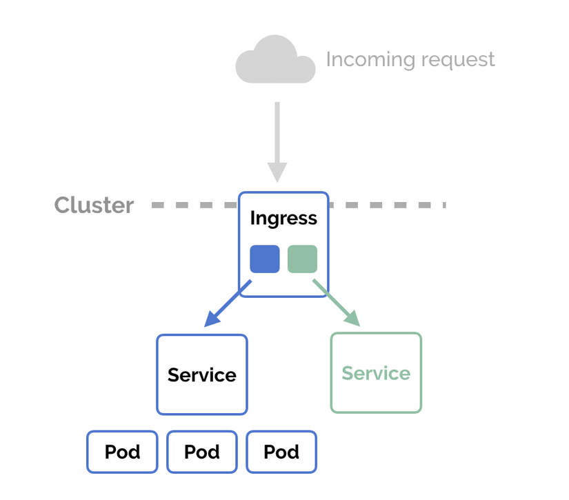
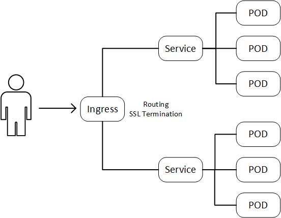

# Kubernetes: An Intro to Scalable Deployment in Production - Part 2


Kubernetes is becoming [more and more popular](https://www.businessinsider.com/kubernetes-5th-anniversary-google-kubecon-2019-6). Strong [community behind Kubernetes](https://containerjournal.com/2019/04/05/explaining-kubernetess-popularity-its-the-community-not-the-technology/), which is the driving force behind it, when combined with the convenience and flexibility that Kubernetes provides, together becomes something that deserves admiration. [In the last article](https://viblo.asia/p/kubernetes-an-intro-to-scalable-deployment-in-production-part-1-Do754k8JlM6) on this series, we discussed on the Kubernetes basics, including concepts like pod, deployment, service and port forwarding. Well, the discussed topics alone covers a large ground, sufficient enough to deploy a mid-scale application.

Armed with the knowledge we gained so far, let's consider a scenario where we have a limited resource available, let's say a single cluster and a single load balancer (since deploying multiple load balancer is pretty expensive :( ). But, our application requires at least two deployment environment (e.g. staging and production). Well, a single load balancer with a single external IP can only be map against one HTTP (port 80) and one HTTPS (port 443) port. But, we need two different sets of port mapping (2 app environment * 2 ports). And, this will result in a port collision. How to get around this issue? Let's get to it! ;)

## Ingress



[Ingress](https://kubernetes.io/docs/concepts/services-networking/ingress/) is the key Kubernetes component that enables us to achieve our objective of virtual hosting on a single cluster. Let's get to know it first. :) It is identical to Kubernetes [service](https://kubernetes.io/docs/concepts/services-networking/service/) component, that manages external access to the services in a cluster. Before knowing ingress, let's highlight on service a bit.

A service is a way to expose an application (pod, set of pods or deployment) as a network service (inside or outside of the cluster). Service can provide load balancing whenever needed. It supports exposing an application through the means of IP and port mapping (supporting both TCP and UDP protocol), allowing an application to be exposed throughout the cluster (aka. type `ClusterIP`), throughout the nodes (aka. type `NodePort`), externally through a load balancer (aka. type `LoadBalancer`) or externally through an external IP (aka. type `ExternalName`). A point to note here is that the `ExternalName` service does not set up any proxy, so no load balancing is performed.

On the other hand, ingress exposes an application as a network service externally through a load balancer (identical to `LoadBalancer` service type). The exception being, ingress only supports TCP with port 80 (HTTP) and 443 (HTTPS). At this point, you might be wondering, since `LoadBalancer` service and ingress are both apparently performing the same task, what's the speciality of ingress? Let's check it out! :D

Kubernetes ingress components are meant to be used for web services only, where the usage scenario of a service can be considered generic.

The following features are exclusive to ingress only.

- **Single backend**: In this mode, incoming traffic is always routed to a fixed backend (identical to `Service`)
- **Simple fanout**: This mode routes incoming traffic to different backends based on the URI
- **Name based virtual hosting**: Routes incoming traffic to different backends based on the `Host` header
- **TLS termination**: When configured for TLS with TLS credentials, it terminates HTTPS traffic and routes to matching backend.
- **SNI**: When configured to passthrough HTTPS traffic, it routes incoming traffic to different backends using TLS SNI
- **Fallback backend**: Ingress provides a fallback backend to support the scenarios where an incoming client request does not match any defined rules

It is important to note that, just defining an ingress resource, and applying it not necessarily creates an ingress component. In order for an ingress component to exist and work properly, a supported [ingress controller](https://kubernetes.io/docs/concepts/services-networking/ingress-controllers/) must exist in a kubernetes deployment. Also, many feature availabilities are either dependent and / or exclusive to a particular ingress controller only.

In this article, we're gonna use the Nginx ingress controller. Let's [install the controller](https://kubernetes.github.io/ingress-nginx/deploy/) first.

## Multi-domain Hosting on a Cluster

If we use a `LoadBalancer` service to expose an application in a cluster, it will provide only the load balancing feature. And, all the traffic will be routed to the mapped application in the cluster. While this configuration is sufficient for an application that requires only a single domain configuration, it is impossible to perform name based virtual hosting like the scenario in the diagram as follows.

```text
example1.com --|                 |-> example1 service1:80
               |   23.24.25.26   |
example2.com --|                 |-> example2 service2:80
```

This is where ingress comes to play. Ingress supports scenario like this where an incoming request needs to be routed to a specific backend, based on the `Host` header.

Here's a basic configuration of an ingress component that facilitates name based virtual hosting.

```yml
apiVersion: extensions/v1beta1
kind: Ingress
metadata:
  name: example-ingress
  annotations:
    kubernetes.io/ingress.class: "nginx"
spec:
  rules:
  - host: example1.com
    http:
      paths:
      - path: /
        backend:
          serviceName: service1
          servicePort: service1-port1
  - host: example2.com
    http:
      paths:
      - path: /
        backend:
          serviceName: service2
          servicePort: service2-port1
```

Let's investigate! The configuration itself is a YAML like any other Kubernetes component. When NGINX ingress is installed, it automatically discovers and processes all the ingress components with `kubernetes.io/ingress.class: "nginx"` annotation. Since our ingress is intended to be processed by NGINX ingress, the specified annotation at `ingress.metadata.annotations` ensures it.

Our ingress specifies a list of rules at `ingress.spec.rules`. For our configuration, each rule specifies a `host` which is matched against the `Host` header of all incoming requests. If no match is found, the default backend handles the request.

Each `ingress.spec.rules[].http.paths[]` specify one or more `path`, against each of which a backend is configured. Each leaf level path (e.g. `/cat/jerry`) gains precedence over the root level path (e.g. `/cat`). This implies that, if we have a configuration as follows, `/nested` will route to `servicex`.

```yml
      paths:
      - path: /
        backend:
          serviceName: service1
          servicePort: service1-port1
      - path: /nested
        backend:
          serviceName: servicex
          servicePort: servicex-port1
```

Once the configuration is ready, we can create a new ingress using, `kubectl apply -f <INGRESS_CONFIGURATION_FILE>`. An ingress status can be checked using `kubectl describe ingress <INGRESS_NAME>`

## HTTPS Termination and Backend Routing

The above configuration works only for HTTP traffic. HTTPS / TLS configuration requires some extra step and is a bit tricky. There are two different ways to configure an ingress for HTTPS traffic.

### #1 Ingress terminates HTTPS



Remember, ingress feature includes terminating TLS. In order to utilize an ingress as a TLS terminator, we need to properly configure the TLS credentials. TLS credential management is tricky. In Kubernetes, TLS credential management is often performed using [cert-manager](https://github.com/jetstack/cert-manager), which is a Kubernetes add-on to automate the management and issuance of TLS certificates from various issuing source. Currently available issuer type includes,

- CA
- Self signed
- ACME
- Vault
- Venafi

Before proceeding, we need to [install *cert-manager*](https://docs.cert-manager.io/en/latest/getting-started/install/index.html).

TLS termination through ingress and *cert-manager* requires configuration of the following components.

- Issuer
- Certificate
- Ingress

Let's go through the basic configuration of each of the components.

#### Issuer Configuration

Kubernetes `Issuer` component is a *cert-manager* resource, which represents a TLS certificate issuer. For ease of demonstration, we're gonna choose self-signed issuer.

In Kubernetes every component is namespaced. Depending on the namespace resolution, any of the following issuers can be defined.

- `Issuer`: Scoped to a specific namespace. An `Issuer` defined in a namespace can only be used in that particular namespace.
- `ClusterIssuer`: Scoped to the cluster. A `ClusterIssuer` can be used from components in any namespace in a cluster.

Let's define a `ClusterIssuer`.

```yml
apiVersion: certmanager.k8s.io/v1alpha1
kind: ClusterIssuer
metadata:
  name: clusterissuer-self
spec:
  selfSigned: {}
```

The above YAML defines a `ClusterIssuer` that can be accessed from any namespace in a cluster. `clusterissuer.spec.selfsigned` enables a self signing CA.

Now, we can deploy the issuer using, `kubectl apply -f <ISSUER_CONFIGURATION_FILE>`. And, the issuer status can received from `kubectl describe clusterissuers.certmanager.k8s.io <ISSUER_NAME>`.

#### Certificate Generation and Renewal

Now that we have a certificate issuer, it's time to set up the configuration for certificate generation and renewal. `Certificate` resource does this job. The configuration looks as follows.

```yml
apiVersion: certmanager.k8s.io/v1alpha1
kind: Certificate
metadata:
  name: self-crt
spec:
  secretName: self-cert-secret
  commonName: "self-root-ca"
  isCA: true
  issuerRef:
    name: clusterissuer-self
    kind: ClusterIssuer
```

Notice that `certificate.spec.issuerref` references the `ClusterIssuer` that we created. `certificate.spec.secretname` indicates the name of the `Secret` component where the TLS credential will be stored once the certificate is generated. TLS credential contains *ca.crt*, *tls.crt* and *tls.key*.

Certificate configuration can be deployed using `kubectl apply -f <CERTIFICATE_CONFIGURATION_FILE>`, and certificate details can be seen using `kubectl describe certificate <CERTIFICATE_NAME>`. Here's an example.

```text
Name:         self-crt
Namespace:    default
Labels:       <none>
Annotations:  kubectl.kubernetes.io/last-applied-configuration:
                {"apiVersion":"certmanager.k8s.io/v1alpha1","kind":"Certificate","metadata":{"annotations":{},"name":"self-crt","namespace":"default"...
API Version:  certmanager.k8s.io/v1alpha1
Kind:         Certificate
Metadata:
  Creation Timestamp:  2019-06-08T02:37:48Z
  Generation:          3
  Resource Version:    2951830
  Self Link:           /apis/certmanager.k8s.io/v1alpha1/namespaces/default/certificates/run1-self-crt
  UID:                 6796b400-8906-11e9-a907-42010a80419b
Spec:
  Common Name:  self-root-ca
  Is CA:        true
  Issuer Ref:
    Kind:       ClusterIssuer
    Name:       clusterissuer-self
  Secret Name:  self-cert-secret
Status:
  Conditions:
    Last Transition Time:  2019-06-08T02:40:45Z
    Message:               Certificate is up to date and has not expired
    Reason:                Ready
    Status:                True
    Type:                  Ready
  Not After:               2019-09-06T02:40:45Z
Events:                    <none>
```

Once the certificate is issued, it will be scheduled to be renewed automatically.

#### Configuring Ingress as a TLS Terminator

At this point, we have have TLS credentials that is automatically managed. Now we can utilize the credential from an ingress as follows.

```yml
apiVersion: extensions/v1beta1
kind: Ingress
metadata:
  name: example-ingress
  annotations:
    kubernetes.io/ingress.class: "nginx"
spec:
  rules:
  - host: example1.com
    http:
      paths:
      - path: /
        backend:
          serviceName: service1
          servicePort: service1-port1
  - host: example2.com
    http:
      paths:
      - path: /
        backend:
          serviceName: service2
          servicePort: service2-port1
  tls:
    - hosts:
      - example1.com
      - example2.com
      secretName: self-cert-secret
```

The configuration above is very much identical to the ingress configuration we have seen earlier, except for the addition of `ingress.spec.tls[]`. This key defines a list of hosts for which `ingress.spec.tls[].secretname` TLS credential should be used.

Once this component is deployed, the following will happen.

- Ingress will attempt to terminate any incoming HTTPS traffic with value `example1.com` or `example2.com` for `Host` header, with TLS credential `self-cert-secret`.
- Any incoming HTTP traffic with value `example1.com` or `example2.com` for `Host` header will be redirected to the HTTPS route with a permanent redirection code `308`. This is because, HSTS is enabled by default (HSTS and many other TLS configurations can be edited throughout the cluster or on a per service basis).

And, now we have successfully set up an ingress for HTTPS termination.

### #2 Ingress passes HTTPS traffic to Backend

Ingress can also be configured to pass-through HTTPS traffic directly to backend, instead of terminating it. This is achieved by leveraging TLS SNI. But, due to performance issue, this approach is not recommended. Check out the [documentation](https://kubernetes.github.io/ingress-nginx/user-guide/tls/#ssl-passthrough) for more details.

---

So far, we went through different configurations of an ingress in order to enable name-based virtual hosting on a single cluster, and different TLS configurations for HTTPS traffic. Demonstrated configurations have a large number of use cases and advantages, which significantly includes, resource and cost optimization in small and mid-scale projects. In an upcoming article, we'll go through on-premise Kubernetes deployment! :D Till then, happy deploying! ;)

## References

- Ingress: https://kubernetes.io/docs/concepts/services-networking/ingress/
- Ingress controller: https://kubernetes.io/docs/concepts/services-networking/ingress-controllers/
- NGINX ingress controller: https://github.com/kubernetes/ingress-nginx
- TLS configuration: https://kubernetes.github.io/ingress-nginx/user-guide/tls/
- Cert-manager: https://github.com/jetstack/cert-manager
- Images
  - Kubernetes: https://stackify.com/kubernetes-docker-deployments/
  - Ingress: https://matthewpalmer.net/kubernetes-app-developer/articles/kubernetes-ingress-guide-nginx-example.html
  - Ingress TLS: https://blogs.msdn.microsoft.com/mihansen/2018/05/31/kubernetes-ingress-in-azure-government/

